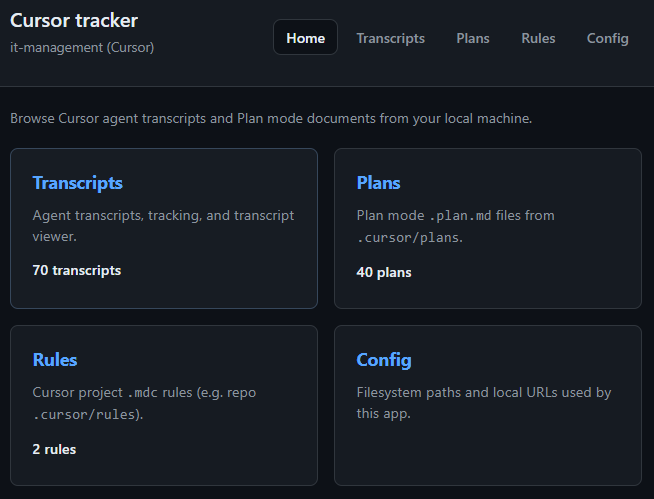
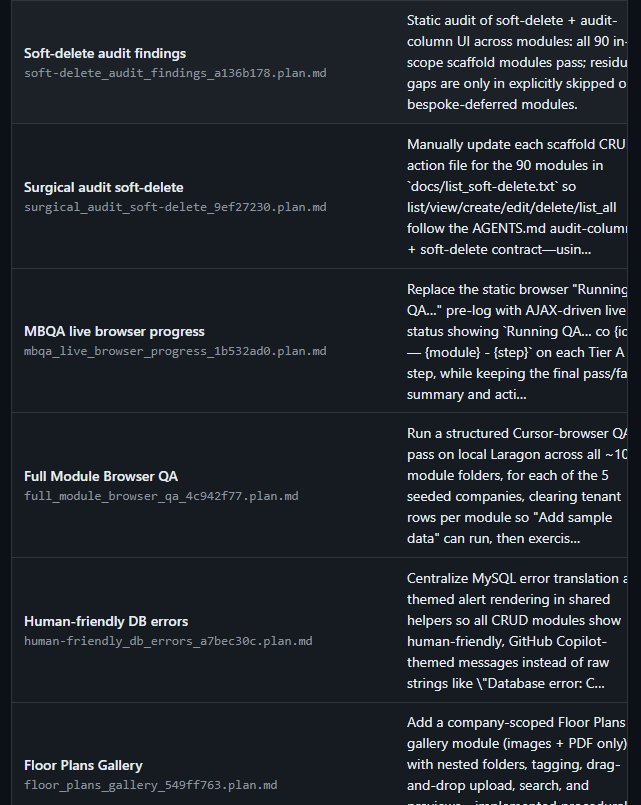
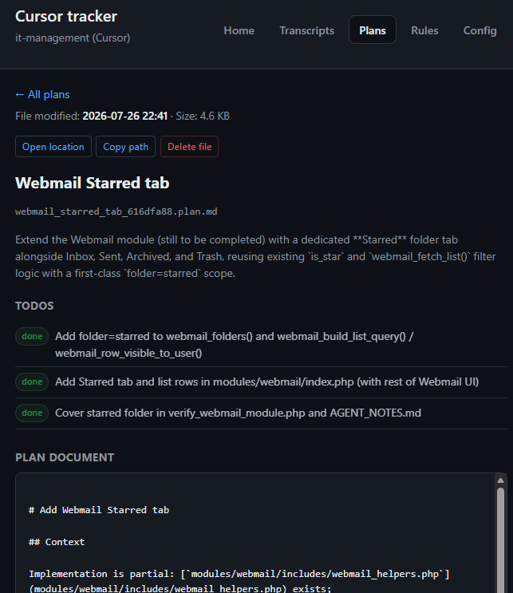

# Cursor tracker (transcripts + plans + rules)

Local PHP dashboard for **Cursor agent transcripts**, **Plan mode** files, and **project rules**.

**Local URL:** open in a new browser tab (adjust host/path for your stack): [http://localhost/cursor_tracking/](http://localhost/cursor_tracking/)

## Screenshots

**Home**

**Plans list**

**Plan detail**

## Pages

| Page | URL |
|------|-----|
| Home | [http://localhost/cursor_tracking/](http://localhost/cursor_tracking/) |
| Transcripts | [http://localhost/cursor_tracking/chats.php](http://localhost/cursor_tracking/chats.php) |
| Plans | [http://localhost/cursor_tracking/plans.php](http://localhost/cursor_tracking/plans.php) |
| Rules | [http://localhost/cursor_tracking/rules.php](http://localhost/cursor_tracking/rules.php) |
| Config | [http://localhost/cursor_tracking/settings.php](http://localhost/cursor_tracking/settings.php) |
| Transcript detail | `chat.php?id={uuid}` |
| Plan detail | `plan.php?f={basename}.plan.md` |
| Rule detail | `rule.php?f={basename}.mdc` |

## What it does

### Transcripts

- Scans read-only JSONL under your Cursor project `agent-transcripts` folder
- Lists parent transcripts, nested subagents, tracking (star, status, notes)
- Tracking stored in `data/tracking.json`

### Plans

- Lists `*.plan.md` from `%USERPROFILE%\.cursor\plans\` (config: `plans_dir`)
- Parses frontmatter (`name`, `overview`, `todos`) and shows full plan body on detail page

### Rules

- Lists `*.mdc` from your repo `.cursor/rules` folder (config: `rules_dir`; default points at `it-management\.cursor\rules`)
- Shows frontmatter `description` / `alwaysApply` and full file on the detail page
- **Open location** / **Copy path** like Plans
- **Delete** removes the `.mdc` file from disk (list + detail), same as Plans

## Setup

**Requires PHP 7.4+** (no Composer; on Windows, `com_dotnet` helps Explorer launch from PHP).

1. Serve this folder with Apache, nginx, or `php -S` (XAMPP, WAMP, or similar).
2. Paths: use **[Config](http://localhost/cursor_tracking/settings.php)** to edit and save (stored in `data/local_config.json`), or edit defaults in `config.php`.
   - `transcripts_dir` — your project `agent-transcripts` path
   - `plans_dir` — e.g. `C:\Users\YOU\.cursor\plans`
   - `rules_dir` — e.g. `C:\…\it-management\.cursor\rules`
3. `data/.htaccess` blocks direct web access to `tracking.json`.

## Privacy

Transcripts and plans may contain secrets. **Local-only** — do not expose on a public host without auth.

## Open location (Windows)

Browsers cannot open `file://` from `http://localhost`. **Open location** calls PHP to run Explorer.

If Explorer does not appear (common when Apache runs as a Windows **service** without a desktop):

1. **Path is copied** when you click Open location — press **Win+E**, paste into the address bar, Enter.
2. Start Apache from your local stack’s control panel so it runs in your desktop session (not only as a Windows service).
3. In the **php.ini used by Apache**, enable **`extension=com_dotnet`** and restart the web server — this improves Explorer launch via `WScript.Shell`.

## Git

Outside the `it-management` repository unless you version this folder separately.
